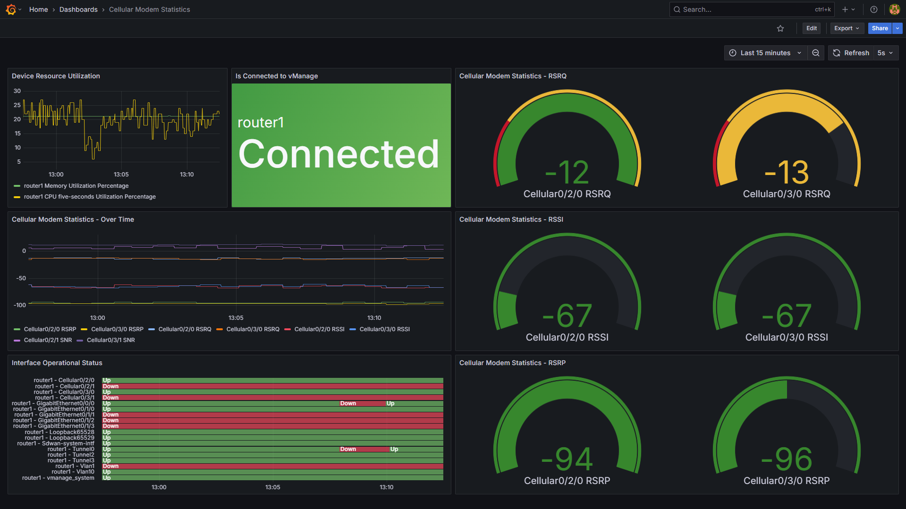

# Monitoring using NETCONF

The goal here is to get telemetry data with NETCONF.

## Components:
- NETCONF-capable Device - Used a Cisco IOS-XE device in this instance
- Telegraf - Data Collection
- Prometheus - Time-Series Database
- Grafana - Visualization

Forked from https://github.com/anirudhkamath/monitoring-practice-with-netconf

## Requirements

Have [docker-compose](https://docs.docker.com/compose/install/) installed, alongside Docker.

## Running this tool

1. Clone the repository with `https://github.com/qmph22/MDT-with-NETCONF-on-IOS-XE.git`
2. Move into the directory with `cd MDT-with-NETCONF-on-IOS-XE`
3. Create an environmental variable in the `.env` file. Place your password in there. Create multiple environmental variables if you intend on using multiple passwords.
4. Create specify your devices in `telegraf/networkdevices.yml`. For the password, specify the environmental variable name you created in the `.env` file.
   - You can copy `networkdevices.example.yml` to `networkdevices.yml` with `cp telegraf/networkdevices.example.yml telegraf/networkdevices.yml` to help you get started.
5. Run the following:
```bash
docker-compose build
docker-compose up
```
6. View metrics collected by Telegraf at http://localhost:9273/metrics
7. View metrics being stored by Prometheus at http://localhost:9090/
8. View the dashboards in Grafana at http://localhost:3000/

## PromQL queries supported

- intf_stats_in_octets
- intf_stats_in_errors
- intf_stats_out_octets
- intf_stats_out_errors
- intf_stats_admin_status
- intf_stats_operational_status
- cpu_process_consumed_bytes
- cpu_utilization_percentage
- memory_pool_percent_used
- cellular_modem_radio_rsrp
- cellular_modem_radio_rsrq
- cellular_modem_radio_rssi
- cellular_modem_radio_snr

# Development
1. Clone the repository with `https://github.com/qmph22/MDT-with-NETCONF-on-IOS-XE.git`
2. Move into the directory with `cd MDT-with-NETCONF-on-IOS-XE`
3. Create a Python virtual environment with `python -m venv`
4. Enter the Python virtual environment (if on Linux) with `source venv/bin/activate`
5. Install the required packages with `pip3 install ncclient xmltodict dotenv pyyaml typing`
6. Create an environmental variable in the `.env` file. Place your password in there. Create multiple environmental variables if you intend on using multiple passwords.
7. Create specify your devices in `telegraf/networkdevices.yml`. For the password, specify the environmental variable name you created in the `.env` file.
   - You can copy `networkdevices.example.yml` to `networkdevices.yml` with `cp telegraf/networkdevices.example.yml telegraf/networkdevices.yml` to help you get started. 
8. When ready to test the Docker stack, run the following:
```bash
docker-compose build
docker-compose up
```
or 
```bash
docker compose up --build
```

## Tips
- Always be in the `telegraf` directory if executing the Python scripts from CLI. For example, first `cd telegraf` then `python3 netconf-cellular.py`.
- Always be in the top-level directory of `MDT-with-NETCONF-on-IOS-XE` before running any `docker compose` commands.
- If making changes other than just the readme, do them in a different branch of this project.

# To Do
1. Develop `input.execd` plugin for Telegraph to actually stream telemetry instead of just gathering it at a specified interval (it works but it could work better
2. Update the dashboard to show the relationship between an interface's operational state and administrative state
